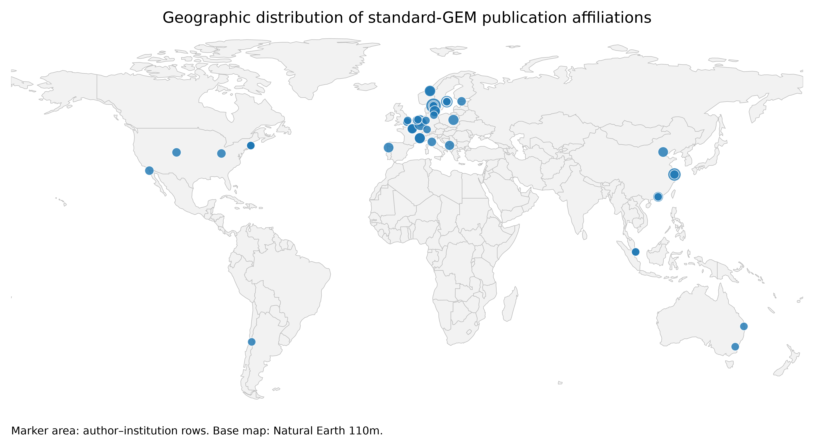

## Affiliation Map

Generate a geographic map of publication author affiliations from a list of DOIs.

This repository contains a small Python workflow that:

1. Reads a CSV file containing publication DOIs.
2. Looks up each DOI in the [OpenAlex API](https://developers.openalex.org/api-reference/introduction).
3. Extracts author, institution, ROR, country, and geolocation metadata.
4. Writes a normalized affiliation table to `affiliations.csv`.
5. Generates static map outputs as `affiliation_map.svg` and `affiliation_map.png`.

The current map shows the geographic distribution of affiliations associated with a set of publications related to genome-scale metabolic modelling / standard-GEM work.



### Repository contents

| File | Description |
|---|---|
| `make_map.py` | Main script. Reads DOI input, queries OpenAlex, writes affiliation metadata, and renders the map. |
| `dois.csv` | Input CSV containing one DOI per row. Must include a column named `doi`. |
| `affiliations.csv` | Generated affiliation-level output table. |
| `affiliation_map.svg` | Generated vector map. |
| `affiliation_map.png` | Generated high-resolution raster map. |
| `requirements.txt` | Python dependencies. |
| `cache/` | Cached OpenAlex and Natural Earth responses used to avoid repeated downloads/API calls. |

### How to run

```bash
python -m venv .venv
source .venv/bin/activate
pip install -r requirements.txt
# export OPENALEX_API_KEY="your-api-key"
python make_map.py dois.csv
```

This workflow uses:
- [OpenAlex](https://openalex.org) for publication, authorship, institution, ROR, and geolocation metadata.
- [Natural Earth]([url](https://www.naturalearthdata.com/)) for country boundary geometries used in the static base map.
